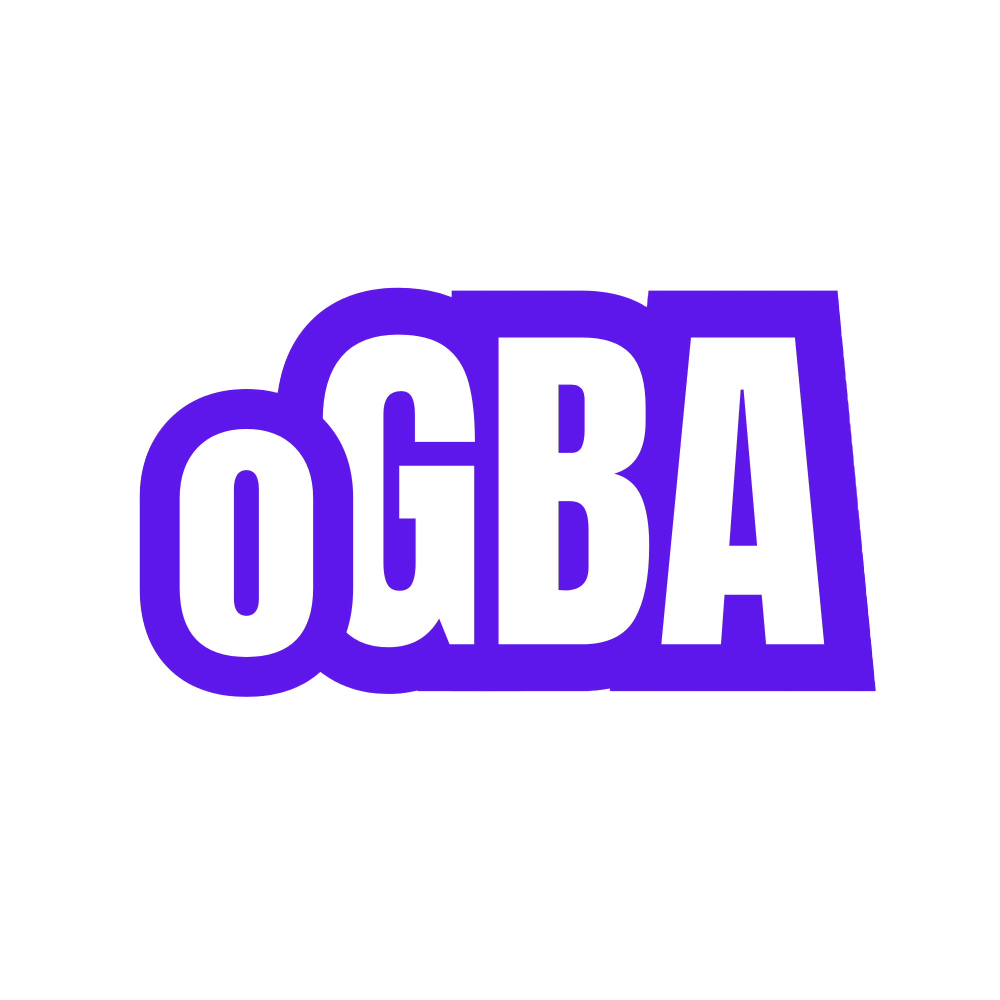

  

  <strong>Play Game Boy Advance games in your browser, on any device, and pick up where you left off.</strong>
   
  <a href="https://ogba-nine.vercel.app">ogba-nine.vercel.app</a>

---

oGBA is a GBA emulator that runs entirely in the browser. Open the page, load a `.gba` file, and play. There's nothing to install. It feels like a handheld on your phone and stays out of the way on your desktop, and your progress follows you between the two.

## Highlights

- **Full-speed emulation.** oGBA runs [mGBA](https://mgba.io), one of the most accurate GBA emulators, compiled to WebAssembly. Games run at full speed on laptops and phones alike.
- **A real handheld feel on mobile.** Phones and tablets get a [Delta](https://github.com/rileytestut/Delta)-style controller skin with multi-touch, D-pad diagonals, thumb-sliding between buttons and haptic taps. Rotate to landscape for a full-screen view with translucent controls. You can import any GBA `.deltaskin` from the menu.
- **A clean desktop view.** On a computer you get the game screen as large as it fits at a crisp scale, a side panel, and keyboard controls.
- **Saves that follow you.** Sign in with Google to get three cloud save slots per game, so you can save on your laptop and continue on your phone.
- **Nothing lost on reload.** In-game saves and an automatic resume point are kept on your device, even when you're not signed in.
- **Installable and works offline.** Add oGBA to your home screen. After the first visit it loads instantly and plays without a connection; only cloud saves need one.

## Controls

| GBA | Keyboard | Touch |
| --- | --- | --- |
| D-pad | Arrow keys | Skin D-pad |
| A / B | X / Z | Skin buttons |
| L / R | Q / E | Skin shoulders |
| Start / Select | Enter / Backspace | Skin buttons |
| Menu | — | Skin menu button (pauses the game) |

## How your data is handled

- **ROMs never leave your device.** The game you're playing is stored only in your browser so it can resume; it's never uploaded.
- **Cloud saves are private.** Save states are compressed and stored under your account, and row-level security ensures only you can read them.
- **Sign-in shows Supabase's address.** Google's account picker names the auth server (`*.supabase.co`), which handles sign-in for oGBA.

oGBA doesn't ship any games. Please only play ROMs you own.

## Built with

[mGBA WASM](https://github.com/thenick775/mgba/tree/feature/wasm) · React · TypeScript · Vite · Tailwind CSS · [Supabase](https://supabase.com) (Auth, Postgres, Storage) · pdf.js (for skin artwork) · Vercel

Default skin: **DarkSP** (Delta skin format).

---

oGBA is a fan project and is not affiliated with or endorsed by Nintendo. Game Boy Advance is a trademark of Nintendo.
